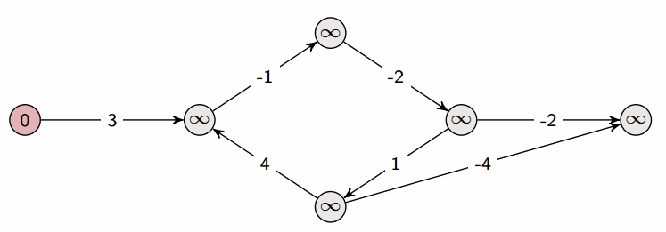

# Reference of Algorithms

---

## Table of Contents

### Combinatorics

[Permutations](#permutations)

[Combinations](#combination)

[Reservoir Sampling](#reservoir-sampling)

[Factorization](#factorization)

### Sorting

[Binary Search](#binary-search)

[Bisect](#bisect)

[Radix Sort](#radix-sort)

[Selection Sort](#selection-sort)

[Insertion Sort](#insertion-sort)

[Bubble Sort](#bubble-sort)

[Merge Sort](#merge-sort)

[Quick Sort](#quick-sort)

[Quick Select](#quick-select)

[Cyclic Sort](#cyclic-sort)

### Graphs

[Floyd Cycle Detection](#floyd-cycle-detection)

[Topological Ordering](#topological-ordering)

[Disjoint Set Union](#disjoint-set-union)

[Dijkstra Shortest Path](#dijkstra-shortest-path)

[Bellman-Ford Propagation Cost](#bellman-ford-propagation-cost)

[SPFA (Shortest Path Fastest Algo) Propagation Cost](#spfa-shortest-path-fastest-algo-propagation-cost)

[Floyd-Warshall Propagation Cost](#floyd-warshall-propagation-cost)

[Kruskal's Minimum Spanning Tree](#kruskals-minimum-spanning-tree)

[Prim's Minimum Spanning Tree](#prims-minimum-spanning-tree)

[Tarjan's SCC (Strongly Connected Components)](#tarjans-scc-strongly-connected-components)

### Trees

[Segment Tree](#segment-tree)

[Trie](#trie)

[Recursive DFS Pre-Order Traversal](#recursive-dfs-pre-order-traversal)

[Iterative DFS Pre-Order Traversal](#iterative-dfs-pre-order-traversal)

[Iterative DFS In-Order Traversal](#iterative-dfs-in-order-traversal)

[Iterative DFS Post-Order Traversal](#iterative-dfs-post-order-traversal)


---


## Combinatorics


### Permutations

Time = `O(n!)`

Space = `O(1)`

```python
def permutations(nums):
  def iter_permutations(num_i):
    if num_i == len(nums):
      yield list(nums)
      return
    for iter_num_i in range(num_i, len(nums)):
      nums[num_i], nums[iter_num_i] = nums[iter_num_i], nums[num_i]
      yield from iter_permutations(num_i + 1)
      nums[num_i], nums[iter_num_i] = nums[iter_num_i], nums[num_i]
  return list(iter_permutations(0))
```

### Combination

Time = `O(n! / (k! * (n - k)!))`

Space = `O(k)`

```python
def subsets(nums):
  subset = []
  def iter_subsets(num_i):
    yield list(subset)
    for iter_num_i in range(num_i, len(nums)):
      subset.append(nums[iter_num_i])
      yield from iter_subsets(iter_num_i + 1)
      del subset[-1]
  return list(iter_subsets(0))
```

### Reservoir Sampling

Time = `O(n)`

Space = `O(1)`

```python
def reservoir_sample(nums, target):
  idx = None
  cnt = 0
  for num_i, num in enumerate(nums):
    if target == num:
      cnt += 1
      if 0 == random.randrange(cnt):
        idx = num_i
  return idx
```

### Factorization

Time = `O(sqrt(n))`

Space = `O(sqrt(n))` if sorted else `O(1)`

```python
def sorted_factors(num):
  stack = []
  root = int(sqrt(num))
  for div in range(1, root + 1):
    mult, rem = divmod(num, div)
    if not rem:
      yield div
      stack.append(mult)
  if (root * root) == num:
    del stack[-1]
  yield from reversed(stack)
```

---


## Sorting


### Binary Search

```python
def search(needle, haystack):
  left_i = 0
  right_i = len(haystack) - 1
  while left_i <= right_i:
    mid_i = (left_i + right_i) // 2
    if needle < haystack[mid_i]:
      right_i = mid_i - 1
    elif needle > haystack[mid_i]:
      left_i = mid_i + 1
    else:
      return mid_i
  return None
```

### Bisect

```python
def bisect(needle, haystack, left=True):
  compare = int.__lteq__ if left else int.__lt__
  left_i = 0
  right_i = len(haystack)
  while left_i < right_i:
    mid_i = (left_i + right_i) // 2
    if compare(needle, haystack[mid_i]):
      right_i = mid_i
    else:
      left_i = mid_i + 1
  return left_i
```

### Radix Sort


Time = `O(n)`

Space = `O(n)`

```python
def sort_array(nums):
  max_abs_num = abs(max(nums, key=lambda n: abs(n)))
  bit_len = len(bin(max_abs_num)) - 2
  for bit_idx in range(bit_len):
    nums = list(iter_radix_sort(nums, bit_idx))
  return list(iter_sort_by_sign(nums))

def get_bit(num, bit_idx):
  return 1 & (num >> bit_idx)

def iter_radix_sort(nums, bit_idx):
  one_bits = []
  for num in nums:
    if get_bit(num, bit_idx):
      one_bits.append(num)
    else:
      yield num
  yield from one_bits

def iter_sort_by_sign(nums):
  positive_nums = []
  for num in nums:
    if num < 0:
      yield num
    else:
      positive_nums.append(num)
  yield from positive_nums
```

### Selection Sort


Time = `O(n^2)`

Space = `O(1)`

```python
def selection_sort(nums):
  for num_i in range(len(nums)):
    min_i = next_min_idx(nums, num_i)
    nums[num_i], nums[min_i] = nums[min_i], nums[num_i]

def next_min_idx(nums, start_idx):
  return min(
    range(start_idx, len(nums)),
    key=lambda num_i: nums[num_i]
  )
```

### Insertion Sort


Time = `O(n^2)`

Space = `O(1)`

```python
def insertion_sort(nums):
  for num_i in range(1, len(nums)):
    while num_i and (nums[num_i - 1] > nums[num_i]):
      nums[num_i - 1], nums[num_i] = nums[num_i], nums[num_i - 1]
      num_i -= 1
```

### Bubble Sort


Time = `O(n^2)`

Space = `O(1)`

```python
def bubble_sort(nums):
  for idx in range(len(nums) - 1):
    for num_i in range(len(nums) - idx - 1):
      if nums[num_i] > nums[num_i + 1]:
        nums[num_i], nums[num_i + 1] = nums[num_i + 1], nums[num_i]
```

### Merge Sort


Time = `O(n⋅log(n))`

Space = `O(n)`

```python
def merge_sort(nums):
  if len(nums) > 1:
    mid_i = len(nums) // 2
    left = merge_sort(nums[:mid_i])
    right = merge_sort(nums[mid_i:])
    nums = ordered_merge(left, right)
  return nums

def ordered_merge(left, right):
  merged = []
  
  left_i = right_i = 0
  while (left_i < len(left)) and (right_i < len(right)):
    if left[left_i] < right[right_i]:
      merged.append(left[left_i])
      left_i += 1
    else:
      merged.append(right[right_i])
      right_i += 1
  
  while left_i < len(left):
    merged.append(left[left_i])
    left_i += 1
  
  while right_i < len(right):
    merged.append(right[right_i])
    right_i += 1
  
  return merged
```

### Quick Sort


Time = `O(n⋅log(n))` on average but has worst case `O(n^2)` when input is already sorted (because the non-random pivot is always the last element)

Space = `O(n⋅log(n))`

```python
def quick_sort(nums):
  partition_and_sort(nums, 0, len(nums) - 1)
  return nums

def partition_and_sort(nums, left_i, right_i):
  if left_i >= right_i:
    return
  part_i = set_partition(nums, left_i, right_i)
  partition_and_sort(nums, left_i, part_i - 1)
  partition_and_sort(nums, part_i + 1, right_i)

def set_partition(nums, left_i, right_i):
  swap_elems(nums, random.randint(left_i, right_i), right_i)
  compare_i = right_i
  right_i -= 1
  
  while left_i <= right_i:
    if nums[left_i] <= nums[compare_i]:
      left_i += 1
    elif nums[right_i] >= nums[compare_i]:
      right_i -= 1
    else:
      swap_elems(nums, left_i, right_i)
  
  swap_elems(nums, left_i, compare_i)
  return left_i

def swap_elems(nums, i, j):
  nums[i], nums[j] = nums[j], nums[i]
```

### Quick Select

> It's like Quick *Sort*, except you only traverse the partition containing your answer.
>
> Result is found once the partition index points at your answer.

Time = `O(n)`

Space = `O(1)`

```python
def quick_select(arr, target_i):
  left_i = 0
  right_i = len(arr) - 1
  while True:
    part_i = set_partition(arr, left_i, right_i)
    if part_i < target_i:
      left_i = part_i + 1
    elif part_i > target_i:
      right_i = part_i - 1
    else:
      break

def set_partition(nums, left_i, right_i):
  '''
  This method is identical to the one used in Quick Sort
  '''
  swap_elems(nums, random.randint(left_i, right_i), right_i)
  compare_i = right_i
  right_i -= 1
  
  while left_i <= right_i:
    if nums[left_i] <= nums[compare_i]:
      left_i += 1
    elif nums[right_i] >= nums[compare_i]:
      right_i -= 1
    else:
      swap_elems(nums, left_i, right_i)
  
  swap_elems(nums, left_i, compare_i)
  return left_i

def swap_elems(nums, i, j):
  nums[i], nums[j] = nums[j], nums[i]
```

### Cyclic Sort


Time = `O(n)`

Space = `O(1)`

```python
def cyclic_sort(nums):
  for idx in range(len(nums)):
    while True:
      target_idx = nums[idx] - 1
      if nums[idx] == nums[target_idx]:
        break
      nums[idx], nums[target_idx] = nums[target_idx], nums[idx]
```


---


## Graphs

### Floyd Cycle Detection


Time = `O(n)`

Space = `O(1)`

```python
def iter_linked_list(node):
  while node:
    yield node
    node = node.next

def find_cycle_start(
  head: Optional['Node']
) -> Optional['Node']:
  fast_iter = iter_linked_list(head)
  slow_iter = iter_linked_list(head)
  while True:
    try:
      next(fast_iter)
      fast = next(fast_iter)
    except StopIteration:
      return None
    slow = next(slow_iter)
    if slow == fast:
      break
  
  find_iter = iter_linked_list(head)
  while True:
    find = next(find_iter)
    slow = next(slow_iter)
    if slow == find:
      return find
```

### Topological Ordering


Time = `O(E + V)`

Space = `O(E + V)`

```python
def topo_order(nodes, dependencies):
  dependency_cnts = defaultdict(int)
  out_degrees = defaultdict(set)
  for in_node, out_node in dependencies:
    dependency_cnts[in_node] += 1
    out_degrees[out_node].add(in_node)
  
  dq = deque()
  for node in nodes:
    if node not in dependency_cnts:
      dq.append(node)
  
  topo_res = []
  while dq:
    node = dq.popleft()
    topo_res.append(node)
    for in_node in out_degrees[node]:
      dependency_cnts[in_node] -= 1
      if not dependency_cnts[in_node]:
        del dependency_cnts[in_node]
        dq.append(in_node)
  
  if dependency_cnts:
    raise UnmetDependencies
  return topo_res
```

### Disjoint Set Union


Time = `O(V)` == `4V` == `InverseAckermann(v)`

Space = `O(V)`

```python
class DSU:
  def __init__(self):
    self.graph = {}
    self.size = {}
  
  def ensure_node(self, key):
    if key not in self.graph:
      self.graph[key] = key
      self.size[key] = 1
  
  def find_root(self, key):
    if self.graph[key] != key:
      self.graph[key] = self.find_root(self.graph[key])
    return self.graph[key]

  def union(self, key_a, key_b):
    root_a = self.find_root(key_a)
    root_b = self.find_root(key_b)
    if root_a != root_b:
      if self.size[root_a] > self.size[root_b]:
        root_a, root_b = root_b, root_a
      self.graph[root_a] = root_b
      self.size[root_b] += self.size[root_a]
      return True
    return False
```

### Dijkstra Shortest Path


Finding the shortest path between 2 points in a:
* **Directed** or Undirected graph
* with edge **weight/cost >= 0**

Time = `O(E⋅log(V))`

Space = `O(V^2)`

```python
def dijkstra(adj_list_costs, src, dst):
  priority_queue = [ (0, -1, src) ]  # cost, steps, node
  while priority_queue:
    cur_cost, steps, node = heapq.heappop(priority_queue)
    if node == dst:
      return cur_cost
    for neighbor, cost in adj_list_costs[node]:
      heapq.heappush(priority_queue, (cur_cost + cost, steps + 1, neighbor))
```

### Bellman-Ford Propagation Cost



Calculating the propagation cost from a starting node to all other nodes in a:
* **Directed** graph
* with **positive and/or negative** edge weight/cost

tl;dr for each node: for each weighted_edge: update src->dst min cost

Time = `O(E⋅V)`

Space = `O(V)`

```python
def bellman_ford(nodes, weighted_edges, start_node):
  costs = {node: float('inf') for node in nodes}
  costs[start_node] = 0
  for _ in range(len(nodes) - 1):
    for src, dst, cost in weighted_edges:
      costs[dst] = min(costs[dst], costs[src] + cost)
  max_cost = max(costs.values())
  if max_cost == float('inf'):
    raise ImpossibleToPropagate
  return max_cost
```

### SPFA (Shortest Path Fastest Algo) Propagation Cost


Calculating the propagation cost from a starting node to all other nodes in a:
* **Directed** graph
* with **positive and/or negative** edge weight/cost

tl;dr while BFS from start: for each edge: BFS if minimal cost

Time = average of `O(E)` but with worst case of `O(E⋅V)`

Space = `O(E + V)`

```python
def spfa(nodes, weighted_edges, start_node):
  costs = {node: float('inf') for node in nodes}
  costs[start_node] = 0
  edge_weights = defaultdict(dict)
  for src, dst, cost in weighted_edges:
    edge_weights[src][dst] = cost
  queue = deque([start_node])
  while queue:
    src = queue.popleft()
    for dst, edge_cost in edge_weights[src].items():
      if costs[src] + edge_cost < costs[dst]:
        costs[dst] = costs[src] + edge_cost
        queue.append(dst)
  max_cost = max(costs.values())
  if max_cost == float('inf'):
    raise ImpossibleToPropagate
  return max_cost
```

### Floyd-Warshall Propagation Cost


Calculating the propagation cost from a starting node to all other nodes in a:
* **Directed** graph
* with **positive and/or negative** edge weight/cost

Like Bellman-Ford/SPFA but able to be distributed, e.g. map-reduce

tl;dr for each stopover: for each src: for each dst: update src->stopover->dst min cost

Time = `O(V^3)`

Space = `O(V^2)`

```python
def floyd_warshall(nodes, weighted_edges, start_node):
  costs = defaultdict(dict)
  for src in nodes:
    for dst in nodes:
      costs[src][dst] = float('inf')
  for src in nodes:
    costs[src][src] = 0
  for src, dst, cost in weighted_edges:
    costs[src][dst] = cost
  for stopover in nodes:
    for src in nodes:
      for dst in nodes:
        costs[src][dst] = min(
          costs[src][dst],
          costs[src][stopover] + costs[stopover][dst]
        )
  max_cost = max(costs[start_node].values())
  if max_cost == float('inf'):
    raise ImpossibleToPropagate
  return max_cost
```

### Kruskal's Minimum Spanning Tree


Finding the propagation cost across the whole network (starting at any node) in an:
* **Undirected** graph
* that is either **Connected or Disconnected**

tl;dr for each sorted_weighted_edge: capture edge cost if dsu.union(node_a, node_b)

(see [Disjoint Set Union](#disjoint-set-union))

Time = `O(E⋅log(V))`

Space = `O(E)`

```python
def kruskal(weighted_edges):
  weighted_edges = sorted(weighted_edges)
  dsu = DSU()
  for cost, node_a, node_b in weighted_edges:
    if dsu.union(node_a, node_b):
      yield cost, node_a, node_b
```

### Prim's Minimum Spanning Tree


Finding the propagation cost across the whole network (starting at any node) in an:
* **Undirected** graph
* that is totally **Connected**

tl;dr while len(visited) != num_nodes: cost, node = pq.pop() && capture cost && for each neighbor: pq.push(neighbor_cost, neighbor)

Time = `O(V^2)`

Space = `O(E)`

```python
def prims(adj_weights):
  node = next(k for k in adj_weights)
  priority_weighted_nodes = [(0, node)]
  visited = set()
  while len(visited) != len(adj_weights):
    node_cost, node = heapq.heappop(priority_weighted_nodes)
    if node in visited:
      continue
    visited.add(node)
    
    yield node_cost, node
    for neighbor_cost, neighbor in adj_weights[node]:
      if neighbor not in visited:
        heapq.heappush(priority_weighted_nodes, (neighbor_cost, neighbor))
```

### Tarjan's SCC (Strongly Connected Components)


Time = `O(E + V)`

Space = `O(V)`

tl;dr DFS(parent): for each neighbor != parent: DFS(neighbor) && yield edge if neighbor_is_min_rank && update min rank

```python
def tarjan(adj_dict: Dict['Node', List['Node']]):
  min_ranks = {}
  def iter_tarjan_dfs(cur_rank, node, parent):
    min_ranks[node] = cur_rank
    cur_rank += 1
    for neighbor in adj_dict[node]:
      if neighbor == parent:
        continue
      if neighbor not in min_ranks:
        yield from iter_tarjan_dfs(cur_rank, neighbor, node)
      if min_ranks[neighbor] == cur_rank:
        yield (node, neighbor)
      min_ranks[node] = min(min_ranks[node], min_ranks[neighbor])
  
  node_a = next(k for k in adj_dict)
  return list(iter_tarjan_dfs(0, node_a, None))
```


---


## Trees


### Segment Tree


Time:
* Construct = `O(n)`
* Update & Query = `O(log(n))`

Space = `O(n)`

**Iterative Implementation**

```python
class SegmentTree:
  def __init__(self, values: list, aggregate_method):
    self.aggregate_method = aggregate_method
    self.len_values = len(values)
    self.tree = [None] * self.len_values + values
    for idx in range(self.len_values - 1, 0, -1):
      # self.tree[idx] = self.tree[idx << 1] + self.tree[(idx << 1) | 1]
      self.tree[idx] = self.aggregate_method(
        self.tree[idx * 2],
        self.tree[idx * 2 + 1]
      )
  
  def update(self, idx: int, val: int) -> None:
    idx += self.len_values
    self.tree[idx] = val
    while idx > 1:
      # self.tree[idx >> 1] = self.tree[idx] + self.tree[idx ^ 1]
      half_idx, half_rem = divmod(idx, 2)
      self.tree[half_idx] = self.aggregate_method(
        self.tree[idx],
        self.tree[idx + (-1 if half_rem else 1)]
      )
      idx = half_idx
  
  def query_range(self, left_i: int, right_i: int):
    iter_values = self.iter_range(left_i, right_i)
    res = next(iter_values)
    for val in iter_values:
      res = self.aggregate_method(res, val)
    return res
  
  def iter_range(self, left_i: int, right_i: int):
    left_i += self.len_values
    right_i += self.len_values
    while left_i <= right_i:
      if left_i % 2:         # if left_i & 1
        yield self.tree[left_i]
        left_i += 1
      left_i //= 2           # left_i >>= 1
      
      if not (right_i % 2):  # if not (right_i & 1)
        yield self.tree[right_i]
        right_i -= 1
      right_i //= 2          # right_i >>= 1
```

**Recursive Implementation**

```python
# type is just an indicative placeholder
# it can be Any that `aggregate_method` supports
VALUE_TYPE = int

class Node(object):
  def __init__(self, left_i: int, right_i: int):
    '''
    Range is inclusive
    '''
    self.left_i = left_i
    self.right_i = right_i
    self.value: VALUE_TYPE = None
    self.left: Node = None
    self.right: Node = None

class SegmentTree(object):
  def __init__(self, values, aggregate_method):
    '''
    Time = O(n)
    '''
    self.aggregate_method = aggregate_method
    self.root = self._init_tree(values, 0, len(values) - 1)
  
  def update(self, idx, val):
    '''
    Time = O(log(n))
    '''
    self._update(self.root, idx, val)
  
  def query_range(self, left_i, right_i) -> VALUE_TYPE:
    '''
    Time = O(log(n))
    Range is inclusive
    '''
    return self._query_range(self.root, left_i, right_i)
  
  def _init_tree(self, values, left_i, right_i) -> Optional[Node]:
    if left_i > right_i:
      return None
    
    root = Node(left_i, right_i)
    if left_i == right_i:
      root.value = values[left_i]
    else:
      mid_i = (left_i + right_i) // 2
      root.left = self._init_tree(values, left_i, mid_i)
      root.right = self._init_tree(values, mid_i + 1, right_i)
      root.value = self.aggregate_method(
        root.left.value,
        root.right.value
      )
    return root
  
  def _update(self, root: Node, idx, val):
    if root.left_i == root.right_i:
      root.value = val
      return
  
    mid_i = (root.left_i + root.right_i) // 2
    if idx <= mid_i:
      self._update(root.left, idx, val)
    else:
      self._update(root.right, idx, val)
    root.value = self.aggregate_method(
      root.left.value,
      root.right.value
    )
  
  def _query_range(self, root: Node, left_i, right_i):
    if (root.left_i == left_i) and (root.right_i == right_i):
      return root.value
    
    mid_i = (root.left_i + root.right_i) // 2
    if right_i <= mid_i:
      return self._query_range(root.left, left_i, right_i)
    elif left_i >= mid_i + 1:
      return self._query_range(root.right, left_i, right_i)
    else:
      return self.aggregate_method(
        self._query_range(root.left, left_i, mid_i),
        self._query_range(root.right, mid_i + 1, right_i)
      )
```

### Trie


Time = `O(k)`, where `k` == `num_chars` in an insert/lookup word

Space = `O(n⋅k)`, where `n` == `num_words` in the trie

```python
class Trie:
  def __init__(self):
    node_factory = lambda: defaultdict(node_factory)
    self.root = node_factory()
    self.terminal_val = ''
  
  def insert(self, word):
    node = self.root
    for char in word:
      node = node[char]
    node[self.terminal_val] = None
```

### Recursive DFS Pre-Order Traversal

Time = `O(n)`

Space = `O(n)`

```python
def pre_order(node):
  yield node
  if node.left: yield from pre_order(node.left)
  if node.right: yield from pre_order(node.right)
```

### Iterative DFS Pre-Order Traversal


Time = `O(n)`

Space = `O(n)`

```python
def pre_order(root):
  stack = []
  while stack or root:
    if root:
      stack.append(root)
      yield root
      root = root.left   
    else:
      root = stack.pop().right
```

### Iterative DFS In-Order Traversal


Time = `O(n)`

Space = `O(n)`

```python
def in_order(root):
  stack = []
  while stack or root:
    if root:
      stack.append(root)
      root = root.left
    else:
      node = stack.pop()
      yield node
      root = node.right
```

### Iterative DFS Post-Order Traversal


Time = `O(n)`

Space = `O(n)`

```python
def post_order(root):
  stack = [[root, False]]  # [[node, is_visited], ...]
  while stack:
    if stack[-1][1]:  # is_visited
      yield stack.pop()[0]
    else:
      stack[-1][1] = True
      node = stack[-1][0]
      if node.right:
        stack.append([node.right, False])
      if node.left:
        stack.append([node.left, False])
```
